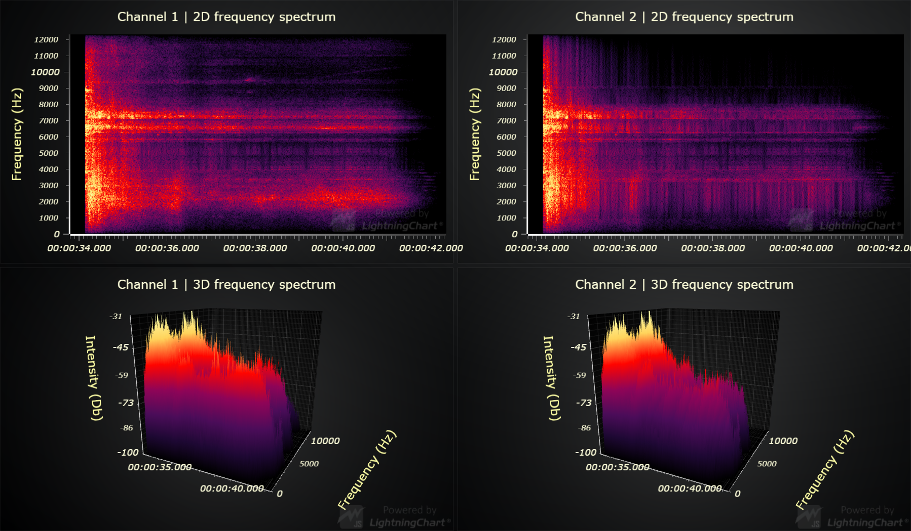

# JavaScript Audio Spectrogram 2D & 3D Chart

This demo application belongs to the set of examples for LightningChart JS, data visualization library for JavaScript.

LightningChart JS is entirely GPU accelerated and performance optimized charting library for presenting massive amounts of data. It offers an easy way of creating sophisticated and interactive charts and adding them to your website or web application.

The demo can be used as an example or a seed project. Local execution requires the following steps:

- Make sure that relevant version of [Node.js](https://nodejs.org/en/download/) is installed
- Open the project folder in a terminal:

        npm install              # fetches dependencies
        npm start                # builds an application and starts the development server

- The application is available at *http://localhost:8080* in your browser, webpack-dev-server provides hot reload functionality.

## Description

This example showcases the `SurfaceScrollingGridSeries` feature of LightningChart JS.

This works otherwise same as `SurfaceGridSeries`, except that it is designed explicitly for applications that are based on pushing new samples in, while shifting old samples out. For this reason, its data modification API is different.

`SurfaceScrollingGridSeries` is the 3D variant of [`HeatmapScrollingGridSeries`](https://www.arction.com/lightningchart-js-api-documentation/v3.2.0/classes/heatmapscrollinggridseries.html). This is highlighted in this example, by displaying the same data in both 2D and 3D at the same time on top of another.

This example visualizes the frequency spectrum of a short audio clip (about 9 seconds long) of a truck driving. The visualization is done in real-time, simulating applications that measure, analyse and display audio metrics in real-time. One such application is the [LightningChart Audio analysis showcase](https://arction.github.io/lcjs-showcase-audio/).

Each spectrogram in this application displays ~33 samples per second, each sample having 308 data points. With 4 spectrograms, this sums to about 10 000 data points per second.

# About Performance

`SurfaceScrollingGridSeries` is one of the latest additions to LightningChart JS, and as such it enjoys from the very latest optimizations. Surface Grid Series is very well optimized for memory consumption and CPU usage.

Contrary to traditional data visualization tools, which perform a full update whenever data is changed, the scrolling grid series append operation is truly lightning fast due to it being designed specifically for this kind of applications. The data input rate of scrolling grid series is virtually unlimited, performing well with even **tens of millions of incoming data points per second**.

The performance bottleneck in scrolling spectrogram applications is generally axis ticks (surprisingly), and if the surface grid is large (several million data points and more) then the render time can start to limit the refresh rate. This is alleviated by using a better Graphics Processing Unit.

# More Surface Examples

- [Static Surface Grid Chart](https://www.arction.com/lightningchart-js-interactive-examples/examples/lcjs-example-0912-surfaceGrid.html) | This example showcases the most simple usage of surface grid series, and also has a bit more detailed description of the related terms.

- [Chunked Surface Grid Chart](https://www.arction.com/lightningchart-js-interactive-examples/examples/lcjs-example-0916-surfaceChunkLoad.html) | This example shows how surface grid series can be split into sub sections which are loaded individually for better performance and response time.

- [Intensity Surface Grid Chart](https://www.arction.com/lightningchart-js-interactive-examples/examples/lcjs-example-0914-surfaceIntensityGrid.html) | This example showcases how surface grid series can be colored based on a different data set than the height map used in this example.

- [All Surface Examples](https://www.arction.com/lightningchart-js-interactive-examples/search.html?t=surface)

## API Links

* [3D chart]
* [3D axis]
* [Paletted Fill]
* [Color lookup table]
* [Color HSV factory]
* [Color shading styles (3D)]
* [Surface Grid Series]
* [Heatmap Grid Series]
* [Legend Box]
* [Axis scroll strategies]
* [Axis tick strategies]

## Support

If you notice an error in the example code, please open an issue on [GitHub][0] repository of the entire example.

Official [API documentation][1] can be found on [Arction][2] website.

If the docs and other materials do not solve your problem as well as implementation help is needed, ask on [StackOverflow][3] (tagged lightningchart).

If you think you found a bug in the LightningChart JavaScript library, please contact support@arction.com.

Direct developer email support can be purchased through a [Support Plan][4] or by contacting sales@arction.com.

[0]: https://github.com/Arction/
[1]: https://www.arction.com/lightningchart-js-api-documentation/
[2]: https://www.arction.com
[3]: https://stackoverflow.com/questions/tagged/lightningchart
[4]: https://www.arction.com/support-services/

© Arction Ltd 2009-2020. All rights reserved.

[3D chart]: https://www.arction.com/lightningchart-js-api-documentation/v3.1.0/classes/chart3d.html
[3D axis]: https://www.arction.com/lightningchart-js-api-documentation/v3.1.0/
[Paletted Fill]: https://www.arction.com/lightningchart-js-api-documentation/v3.1.0/classes/palettedfill.html
[Color lookup table]: https://www.arction.com/lightningchart-js-api-documentation/v3.1.0/classes/lut.html
[Color HSV factory]: https://www.arction.com/lightningchart-js-api-documentation/v3.1.0/globals.html#colorhsv
[Color shading styles (3D)]: https://www.arction.com/lightningchart-js-api-documentation/v3.1.0/
[Surface Grid Series]: https://www.arction.com/lightningchart-js-api-documentation/v3.1.0/
[Heatmap Grid Series]: https://www.arction.com/lightningchart-js-api-documentation/v3.1.0/classes/heatmapgridseriesintensityvalues.html
[Legend Box]: https://www.arction.com/lightningchart-js-api-documentation/v3.1.0/classes/chartxy.html#addlegendbox
[Axis scroll strategies]: https://www.arction.com/lightningchart-js-api-documentation/v3.1.0/globals.html#axisscrollstrategies
[Axis tick strategies]: https://www.arction.com/lightningchart-js-api-documentation/v3.1.0/globals.html#axistickstrategies

